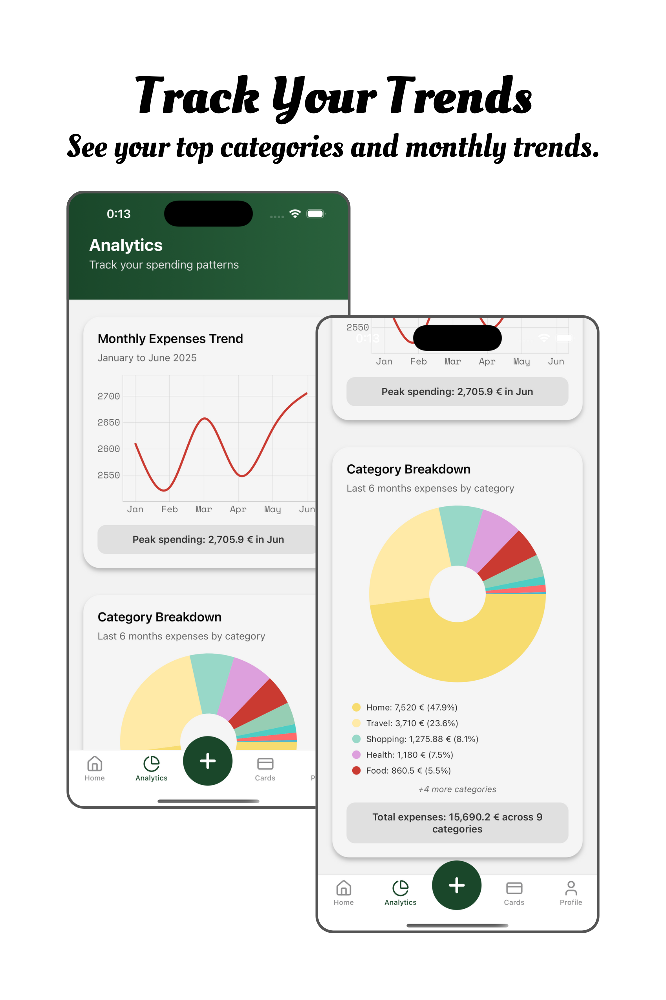
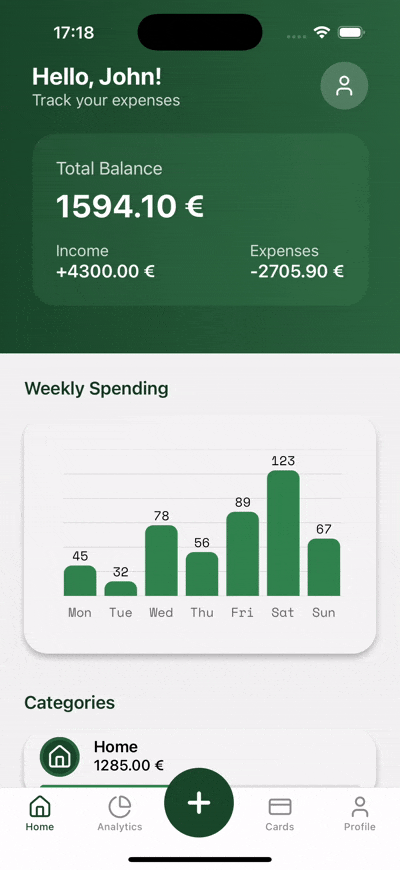

# Expensio 🪄💰

#### Makes managing your expenses so easy - you will think, it's magic!

A modern, intuitive expense tracking mobile application built with React Native, TypeScript, and Redux. Track your spending, manage your budget, and gain insights into your financial habits with beautiful visualizations and seamless user experience.

<table>
<tr>
<td><td>
<td><td>
</tr>
<tr>
<td><td>
</tr>
</table>

## 🚀 Features

### Core Functionality

- **Expense Tracking**: Add, edit, and categorize expenses with ease
- **Income Management**: Track income sources and monitor cash flow
- **Balance Overview**: Real-time balance calculation and financial summary
- **Categories**: Organize expenses by customizable categories (Food, Transport, Shopping, Entertainment, etc.)
- **Transaction History**: Comprehensive list of all financial transactions

### Analytics & Insights

- **Spending Patterns**: Visual charts showing income vs expenses over time
- **Category Breakdown**: Pie charts displaying spending distribution across categories
- **Weekly/Monthly Reports**: Detailed spending analysis and trends
- **Budget Tracking**: Monitor spending against set budgets

### Card Management

- **Payment Methods**: Manage and organize your debit/credit cards
- **Secure Storage**: Safely store card information with encryption
- **Card Analytics**: Track spending per payment method

### User Experience

- **Modern UI/UX**: Clean, intuitive interface with smooth animations
- **Dark/Light Theme**: Support for both light and dark modes
- **Cross-Platform**: Native performance on both iOS and Android
- **Offline Support**: Core functionality available without internet connection

## 📋 Prerequisites

Before you begin, ensure you have the following installed:

- **Node.js** (v16 or higher)
- **npm** or **yarn**
- **Expo CLI**: `npm install -g @expo/cli`
- **iOS Simulator** (for iOS development on macOS)
- **Android Studio** (for Android development)

## 🚀 Getting Started

### Installation

1. **Clone the repository**

   ```bash
   git clone https://github.com/yourusername/expensio.git
   cd expensio
   ```

2. **Install dependencies**

   ```bash
   npm install
   # or
   yarn install
   ```

3. **Start the development server**

   ```bash
   npx expo start
   ```

4. **Run on device/simulator**
   - Press `i` for iOS simulator
   - Press `a` for Android emulator
   - Scan QR code with Expo Go app on your device
